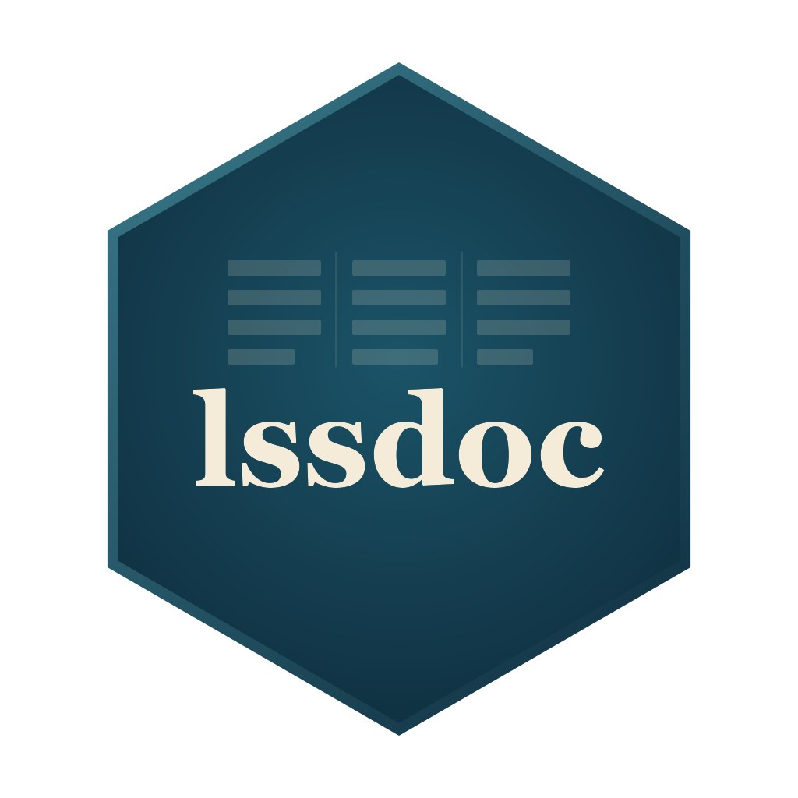

<!-- README.md is generated from README.Rmd. Please edit that file. -->

# lssdoc: Word and PDF questionnaire documents from LimeSurvey `.lss` files 

<!-- badges: start -->

[](https://CRAN.R-project.org/package=lssdoc)
[](https://amaltawfik.r-universe.dev/lssdoc)
[](https://github.com/amaltawfik/lssdoc/actions/workflows/R-CMD-check.yaml)
[](https://app.codecov.io/gh/amaltawfik/lssdoc)
[](https://lifecycle.r-lib.org/articles/stages.html#stable)
[](https://www.repostatus.org/#active)
[](https://opensource.org/licenses/MIT)
[](https://doi.org/10.32614/CRAN.package.lssdoc)
[](https://CRAN.R-project.org/package=lssdoc)
<!-- badges: end -->

**lssdoc** turns a LimeSurvey `.lss` export into a polished Word
(`.docx`) or PDF questionnaire document for anyone working with a
LimeSurvey survey: researchers, survey methodologists, ethics
committees, translators and reviewers. It renders the questionnaire
content side by side in up to four languages, runs an automated
integrity audit, and produces a layout that reads as a published
instrument – not a developer dump.

Two output templates:

- **`"cards"`** – one detached block per item (meta table + question
  table), stacked vertically. Closest to the printed questionnaire a
  respondent would see.

  

- **`"table"`** – one dense table covering the whole document: every
  variable is one tinted *Question* row carrying its metadata, followed
  by one or more white *Value* rows holding the answer codes and their
  labels per language. Group banners (with their description, when
  present), welcome text, survey description and end text become
  labelled rows of the same table so the document reads as a single
  artifact.

  

Other things lssdoc takes care of for you:

- **Multilingual chrome.** Column headers, row labels, type labels
  (Single choice / Multiple choice / Text / Number …), Value
  descriptors, the audit section – everything outside the survey content
  – is translated to English, French, German, Spanish or Italian.
  Independent from the survey’s content languages, so you can keep your
  FR/DE questionnaire and switch the document scaffolding to English (or
  vice versa) with a single argument.
- **Variable-centric compound rendering, matching the data file.** Every
  response variable is documented under the exact column name of the
  LimeSurvey **CSV / Excel export**, so the variable index lines up with
  the raw data file column for column: arrays and multiple choice as
  `parent[subq]` / `parent[other]`, dual-scale arrays split into one
  block per scale (`parent[subq][1]`), two-dimensional arrays as the row
  x column cross-product (`parent[row_col]`), ranking expanded into one
  column per position (`parent[answerid]`), and list-with-comment into
  `parent[_Ccomment]`. Pass `variable_names = "underscore"` for the
  Expression Manager / SPSS / Stata code form (`parent_subq`) instead.
- **Methodological type labels.** UI distinctions like “List (radio)” vs
  “List (dropdown)” collapse into “Single choice”, because the response
  semantics are identical and the actual codes appear in the Value
  section. The Type cell reads in the methodologist’s vocabulary, not
  LimeSurvey’s.
- **Automated audit.** Missing translations, duplicate codes, forward
  references in routing filters, array-scale inconsistencies, orphan
  structural references, types missing their required options or
  subquestions – all flagged inline on the rendered item and, when you
  ask for it, in a dedicated section. No AI; rule-based and reviewable.
- **Local-only processing.** No network calls, no third-party services.
  The questionnaire content never leaves the machine where R runs.

## Installation

Install the released version from CRAN:

``` r
install.packages("lssdoc")
```

Or the latest build from
[R-universe](https://amaltawfik.r-universe.dev/lssdoc) (pre-built, no
compiler needed):

``` r
install.packages(
  "lssdoc",
  repos = c("https://amaltawfik.r-universe.dev", "https://cloud.r-project.org")
)
```

Or the development version from GitHub, with **pak**:

``` r
# install.packages("pak")
pak::pak("amaltawfik/lssdoc")
```

Or with **remotes**:

``` r
# install.packages("remotes")
remotes::install_github("amaltawfik/lssdoc")
```

The package depends on **officer** and **flextable** (declared as
`Suggests` – the parse and audit paths work without them).

## Quick tour

The public API is four functions:

| Function                                   | Role                                                                                   |
|--------------------------------------------|----------------------------------------------------------------------------------------|
| `read_lss(file)`                           | Parse a `.lss` into a structured `lss` object.                                         |
| `audit_lss(input)`                         | Inspect a survey for anomalies; returns an `lss_audit` object with a `print()` method. |
| `render_questionnaire(input, output, ...)` | Render the full questionnaire to a Word or PDF document.                               |
| `render_audit(input, output, ...)`         | Render the audit findings alone to a Word or PDF document.                             |

`audit_lss()`, `render_questionnaire()` and `render_audit()` accept
`input` as either a path to a `.lss` file or a pre-parsed `lss` object.
The output format for the two renderers is inferred from the extension
of `output` (`.docx` or `.pdf`).

### A one-line pipeline

``` r
library(lssdoc)

# Parse the .lss and render the Word document in a single call.
render_questionnaire("survey.lss", "review.docx")
```

The output uses the `"cards"` template by default, with `chrome_lang`
following the survey’s primary content language. Open `review.docx` in
Word, click **Yes** when prompted to update fields (page numbers and the
table of contents).

### Table layout

``` r
render_questionnaire(
  "survey.lss",
  "review.docx",
  languages   = c("en", "fr"),
  template    = "table",
  chrome_lang = "en"
)
```

`languages` controls which content columns appear and in which order;
the first one is the primary language used for the table of contents and
group headings. `chrome_lang` is independent of `languages`: keep
`chrome_lang = "en"` to get English column headers and row labels even
if your survey content runs in French and German – pass
`chrome_lang = "fr"` (or `"de"` / `"es"` / `"it"`) when you want the
scaffolding to follow the content.

### Ethics committee submission

``` r
render_questionnaire(
  "survey.lss",
  "ethics_review.docx",
  languages              = c("en", "fr"),
  template               = "table",
  chrome_lang            = "en",
  show_privacy_settings  = TRUE,   # anonymized / save partial / IP / referrer / timestamp
  show_admin_settings    = TRUE,   # alias / end URL / active
  authors = list(
    list(name        = "Jane Doe",
         affiliation = "HESAV",
         orcid       = "0009-0001-2345-6789"),
    list(name        = "John Doe",
         affiliation = "HESAV",
         orcid       = "0009-0002-3456-7890")
  ),
  description = paste0(
    "Validated as part of the SNSF project XYZ. ",
    "Reference: https://example.org/projects/xyz"
  )
)
```

The cover page picks up the authors block (with clickable ORCID
hyperlinks), the description (with URLs auto-detected and made
clickable), and the privacy / admin settings rows in the metadata table.

### Minimal questionnaire – just the variables

``` r
render_questionnaire(
  "survey.lss",
  "minimal.docx",
  template         = "table",
  show_welcome     = FALSE,
  show_endtext     = FALSE,
  show_description = FALSE,
  show_groups      = FALSE,
  show_toc         = FALSE,
  show_audit       = FALSE,
  show_index       = FALSE
)
```

Pure data: one row per variable header, one row per value code, nothing
else.

### Parse once, render many

``` r
# Parse a single time, then audit and render different variants
# without re-reading the .lss.
lss   <- read_lss("survey.lss")
audit <- audit_lss(lss)
print(audit)  # console summary of flagged anomalies

render_questionnaire(lss, "review_en.docx", languages = "en")
render_questionnaire(lss, "review_fr.docx", languages = "fr")
render_audit(lss, "qa_followup.docx")
```

### See the audit in action

A deliberately flawed survey ships with the package, so you can see what
`audit_lss()` catches without supplying your own file:

``` r
demo <- system.file("extdata", "audit_demo.lss", package = "lssdoc")
audit_lss(read_lss(demo))
#> -- lssdoc audit ----------------------------------------------------
#> 12 findings: 5 errors, 7 warnings, 0 notes.
#> x Survey: duplicate question code 'age'
#> x Question 'age': filter references 'income', asked later (forward reference)
#> x Answer 'X': points to a question id that does not exist
#> x Subquestion 'orphan_sq': points to a question id that does not exist
#> x Question 'blank_q': text empty in every language
#> ! Question 'satisf': expects answer options, but none are defined
#> ! Question 'income': text missing in 'fr'
#> ! Question 'comment ': code carries whitespace
#> ... plus an empty group name, missing subquestions and an array-scale mismatch.
```

### PDF output

``` r
# Same call, just pass a .pdf path. The package writes the .docx
# into a temp file and converts it locally via LibreOffice
# (must be installed and on PATH).
render_questionnaire("survey.lss", "review.pdf", template = "table")
render_audit("survey.lss", "qa.pdf")
```

## Templates and palette

The rendered `.docx` uses an editorial petrol-blue palette tuned for
publication-grade output (`#133B52` primary, `#3A7C8C` accent, `#E9F2F6`
and `#F4F8FA` for tinted bands, `#D3DCE2` for the soft grid). Calibri
body / Consolas monospace by default; the `font` and `font_code`
arguments accept any string to override.

## Citation

Run `citation("lssdoc")` for the up-to-date citation, or cite as:

Tawfik A (2026). *lssdoc: Render ‘LimeSurvey’ ‘.lss’ Questionnaires as
Word and PDF Documents*. <doi:10.32614/CRAN.package.lssdoc>
<https://doi.org/10.32614/CRAN.package.lssdoc>. R package version
0.1.1.9000, <https://CRAN.R-project.org/package=lssdoc>.

## License

MIT. See [`LICENSE`](LICENSE) for the full notice.
