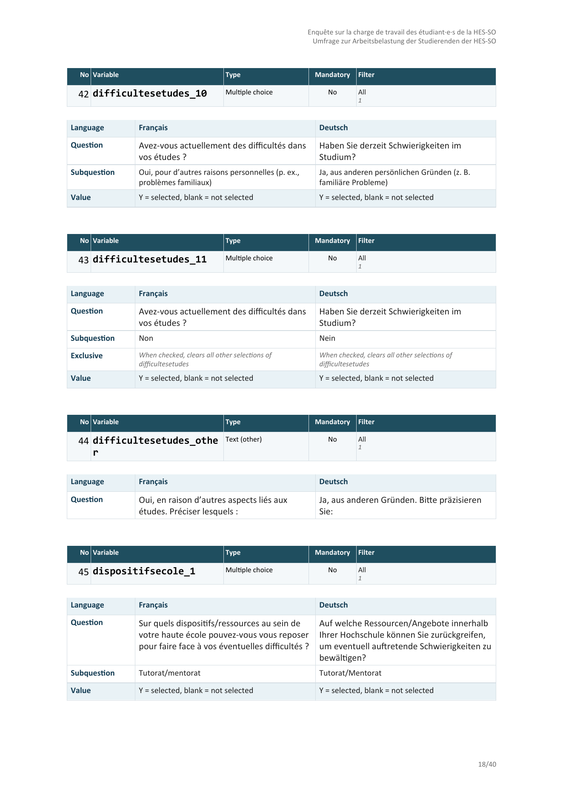
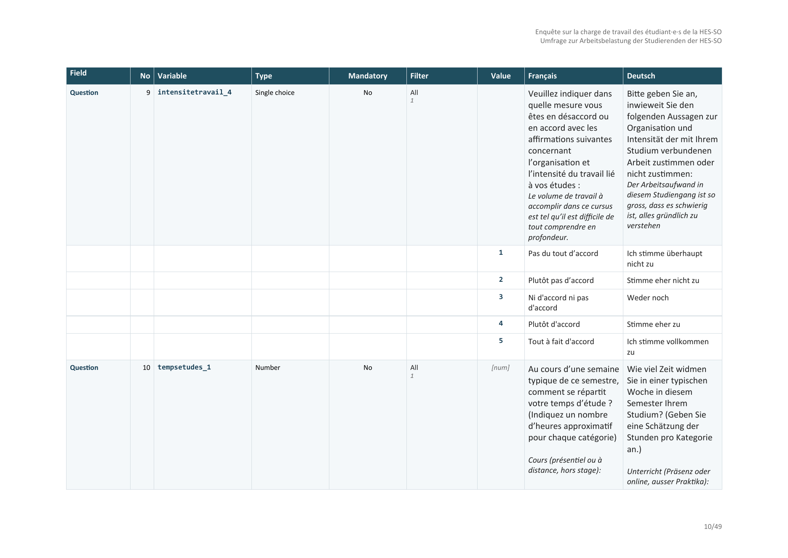

# Get started with lssdoc

**lssdoc** turns a LimeSurvey `.lss` export into a polished Word
(`.docx`) or PDF questionnaire document, displaying up to four languages
side by side, and runs a rule-based audit of the survey. Everything
stays on your machine.

The public API is four functions:

| Function | Role |
|----|----|
| `read_lss(file)` | Parse a `.lss` into a structured `lss` object. |
| `audit_lss(input)` | Inspect a survey for anomalies. |
| `render_questionnaire(input, output, ...)` | Render the full questionnaire to Word or PDF. |
| `render_audit(input, output, ...)` | Render the audit findings alone. |

This vignette uses the demo survey that ships with the package – a
synthetic four-language questionnaire (English, French, German, Spanish)
with quotas and a consent block.

``` r

demo <- system.file("extdata", "demo_survey.lss", package = "lssdoc")
```

## Parse

[`read_lss()`](https://amaltawfik.github.io/lssdoc/reference/read_lss.md)
reads the `.lss` (XML) export into a structured object, preserving every
user-entered string verbatim.

``` r

lss <- read_lss(demo)
lss$languages
#> [1] "en" "de" "es" "fr"
```

## Audit

[`audit_lss()`](https://amaltawfik.github.io/lssdoc/reference/audit_lss.md)
flags reviewable anomalies – missing translations, duplicate codes,
forward filter references, array-scale inconsistencies, orphan
references – as a classed object with a
[`print()`](https://rdrr.io/r/base/print.html) method. The demo survey
is clean; a deliberately broken fixture is included to show the output:

``` r

broken <- system.file("extdata", "audit_demo.lss", package = "lssdoc")
audit_lss(read_lss(broken))
#> 
#> ── lssdoc audit ────────────────────────────────────────────────────────────────
#> File: /tmp/Rtmp3MMNaB/temp_libpath1c31c1c8ae4/lssdoc/extdata/audit_demo.lss
#> Languages: "en" and "fr"
#> 12 findings: 5 errors, 7 warnings, 0 notes.
#> ✖ Survey: Duplicate question code: 'age'.
#> ✖ Question 'blank_q': The question text is empty in every language.
#> ✖ Question 'age': Filter references variable 'income' (item 4), which is not
#>   asked before this question (item 1).
#> ✖ Answer 'X': Answer points to question id '99999', which does not exist.
#> ✖ Subquestion 'orphan_sq': Subquestion points to question id '99999', which
#>   does not exist.
#> Question 'arr': Subquestions reference scale_id '0' but no answer options are
#> defined for it.
#> Question 'arr': Answer options reference scale_id '1' but no subquestions are
#> defined for it.
#> Question 'comment ': The question code 'comment ' contains whitespace;
#> LimeSurvey will export it verbatim, which usually breaks downstream lookups.
#> Group: The group name is empty in every language.
#> Question 'satisf': Type 'Single choice' expects answer options, but none are
#> defined.
#> Question 'rating': Type 'Multiple choice' expects subquestions, but none are
#> defined.
#> Question 'income' [fr]: The question text is missing in 'fr' but present in
#> other languages.
```

## Render

[`render_questionnaire()`](https://amaltawfik.github.io/lssdoc/reference/render_questionnaire.md)
writes the document; the output format is inferred from the file
extension (`.docx` or `.pdf`). Rendering uses the suggested packages and
.

``` r

# Parse once (above), then render different variants without re-reading.
render_questionnaire(lss, "review.docx")
```

Two templates are available. The **`"cards"`** template (default) stacks
one block per item – closest to the printed questionnaire:



The **`"table"`** template is one dense codebook covering the whole
document – one row per variable, with its value codes beneath:

``` r

render_questionnaire(lss, "codebook.docx", template = "table")
```



### Useful arguments

- `languages` – which content columns appear, and in which order
  (`c("en", "fr")`); the first is the primary language.
- `chrome_lang` – language of the *document chrome* (column headers, row
  labels, type labels), independent of the content languages.
- `template` – `"cards"` (default) or `"table"`.
- `variable_names` – `"brackets"` (default) reproduces the LimeSurvey
  CSV/Excel export column names, so the variable index matches the raw
  data file; `"underscore"` uses the SPSS/Stata code form.
- `base_size` – body type size in points (default `10`); raise it
  (e.g. `12`) for a roomier single-language render.
- `page_format` – `"auto"`, `"A4-portrait"`, `"A4-landscape"` or `"A3"`.

``` r

render_questionnaire(
  lss, "review_en_fr.docx",
  languages   = c("en", "fr"),
  template    = "table",
  chrome_lang = "en"
)
```

## PDF output

Pass a `.pdf` path: the package writes a `.docx` to a temporary location
and converts it locally via LibreOffice (which must be installed and on
the `PATH`). No upload, no network call.

``` r

render_questionnaire(lss, "review.pdf")
```

## Audit-only document

[`render_audit()`](https://amaltawfik.github.io/lssdoc/reference/render_audit.md)
produces a focused QA document – the cover page, then one section per
severity – separate from the full review.

``` r

render_audit(lss, "qa.docx")
```
